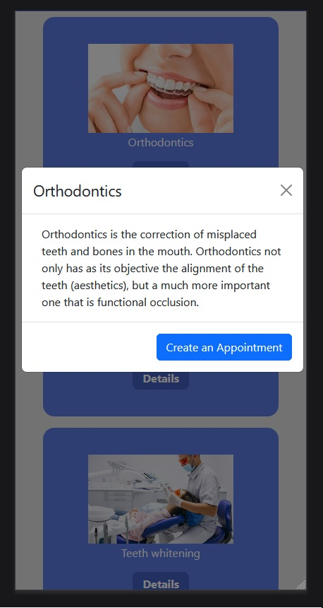

# Proyecto 5: Clinica Dental (Front)

Proyecto creado como ejercicio para GeeksHub Academy.

El objetivo del proyecto es crear el Front Ent de un API REST de un sistema de gestión de usuarios y citas de una clínica dental

## Tecnologías:

Se ha realizado con React, Redux, Bootstrap y NodeJS. 

 ### Estructura:

La web cuenta con una estructura basica, una pagina de Home con una pequeña descripción del lugar, una pagina que muestra todos los posibles tratamientos y uan descripción de estos, y un area de clientes, donde pueden ver y editar los datos de sus perfiles y citas. Por su puesto, tambien cuenta con una pagina de Login y Registro, ademas, de una pagina exclusiva para los Administradores.

 * ### Responsive:
 
La estructura de la pagina fue creada con CSS y Bootstrap, haciendo que se adapte al tamaño de la pantalla del usuario, ya sea un Monitor o la pantalla de un telefono.

 

 * ### Admin:
 
 Los usuarios Admin cuentan con una pagina exclusiva donde pueden obtener un listado de todos los usuarios y citas creadas en el sistema, ademas de poder editar los datos de estos. Cada usuario puede editar los datos de su cuenta, pero, información mas sensible, como el DNI, el Rol y el nombre de un usuario, solo pueden ser modificados por los Administradores.

  

 
 
 
